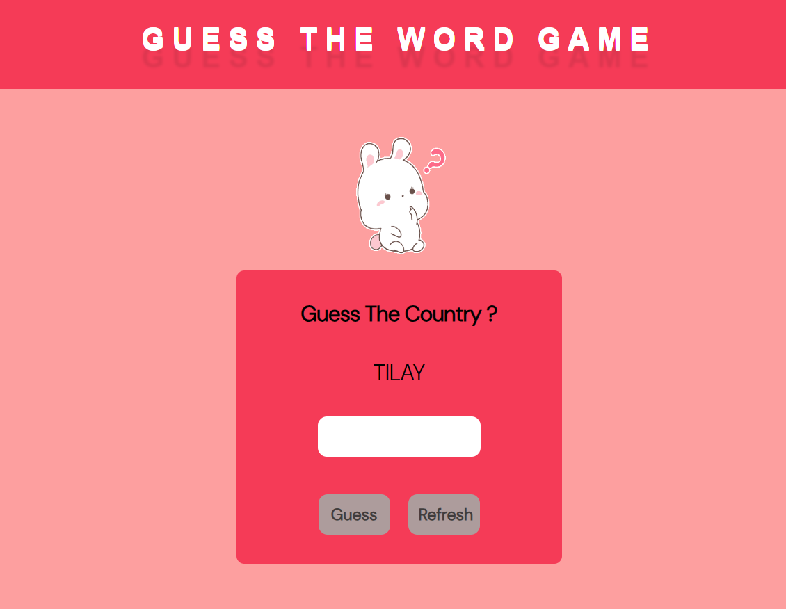

# Word Scramble Game 

## Tech Used
  - html
  - css
  - javaScript

## Code
Here, I have define a function named ``` getRandomWord ```  where i accepted a list of array. Then  i have generate a random index with the using of ```Math.floor(Math.random()  * stringArray.length);``` then i have maked a random word  using of ```stringArray[randomIndex]``` and then stored it into a variable. After that i called a another function to get Scramble word and then return that value.
 ```  getsScrambleWord(randomWord.split("")).join("");```  i have used  ```split("")``` function for splits a string into an array of substrings.  i have used  ```join("")``` function when i got Scramble array of substrings then it will join into a word.

```javaScript:
function  getRandomWord(stringArray) {
// Get a random word from the array.
const  randomIndex  =  Math.floor(Math.random() *  stringArray.length);
randomWord  =  stringArray[randomIndex];
// Split the word into an array of characters.
return  getsScrambleWord(randomWord.split("")).join("");
} 
```
Here, i have used another function named with ```getsScrambleWord``` for Scramble Word.
This Function Accept array of substrings,   i have used `array.sort(() => Math.random() - 0.5);`  to sort an array in random order. It will works by passing a callback function to the `sort()` method. Once the array of substrings is sorted in random order then it will return.

```javaScript:
function  getsScrambleWord(array) {
// Shuffle the array of characters.
array.sort(() =>  Math.random() -  0.5);
return  array;
 }
 ```

## ScreenShot

### Initial Page



### When Player give Wrong Answer


### When Player give Right Answer

